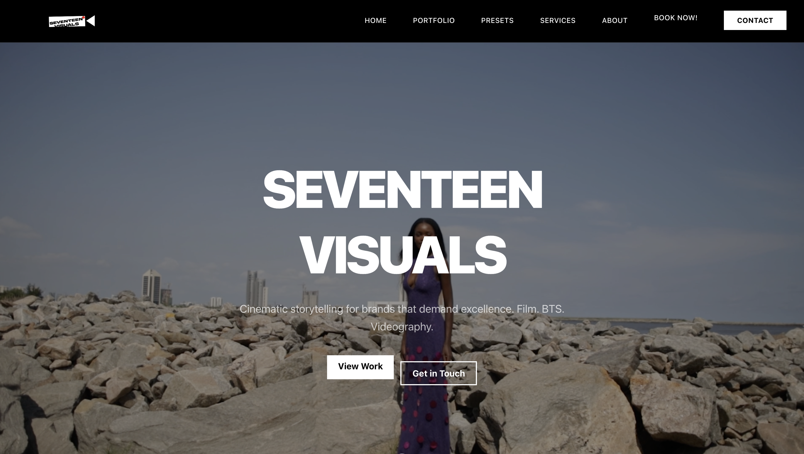

<div align="center">
  <h2 align="center">Ecommerce Store</h2>

This is a fully responsive and functional ecommerce website, Responsive for all devices. <br/> Built using Next.js and TailwindCSS.

<a href="https://ecommerce-w3b.vercel.app/"><strong>➥ Live Demo</strong></a>

</div>

<br />

# Seventeen Visuals — Website

This is the codebase for Seventeen Visuals — a Next.js + Tailwind website showcasing photography/video color-presets, booking, and portfolio pages.

## Key features

- Next.js 16 (Turbopack)
- Tailwind CSS for styling
- Presets gallery with static detail pages
- Multi-step booking flow (client-side)
- Reusable UI primitives and small design system under `components/ui`

## Live demo

If you've deployed this site, replace the link below with your production URL:

[Live demo](#)

## Screenshot



## Getting started

### Prerequisites

- Node.js 18+ (use the version compatible with Next 16)
- pnpm or npm (this project contains a pnpm lockfile but npm scripts work)

### Install

```bash
# from repository root
npm install
# or pnpm install
```

### Run locally

```bash
npm run dev
# open http://localhost:3000
```

### Build for production

```bash
npm run build
npm run start
```

### Deploy

This repo has been deployed with Firebase hosting in the past. A simple deploy using the Firebase CLI looks like:

```bash
firebase deploy
```

## Project structure (important parts)

- `app/` — Next.js App Router routes and pages
  - `app/presets` — presets index and detail pages (static pages like `cinematic-orange-teal` and `urban-night`)
  - `app/book/page.tsx` — booking multi-step form
- `components/` — site components and UI primitives
  - `components/ui/` — form controls, modal, purchase form, etc.
- `lib/presets-data.ts` — sample presets list and helper to look up presets
- `public/` — static images used by the site

## Presets pages

Two static preset detail pages were added:

- `/app/presets/cinematic-orange-teal/page.tsx`
- `/app/presets/urban-night/page.tsx`

These pages are static server-rendered pages with descriptions and usage tips. The main presets index (`/app/presets/page.tsx`) links to them.

## Purchase flow & modals

- There is a reusable `Modal` component at `components/ui/modal.tsx` and a `PurchaseForm` at `components/ui/purchase-form.tsx`.
- I can wire the Buy Now buttons on the preset detail pages to open the purchase modal (ask me to do that and I will implement it).

## Scripts

- `npm run dev` — starts development server
- `npm run build` — build for production
- `npm run start` — run production server
- `npm run lint` — run ESLint

## Tips for contributors

- Add new presets by creating a new folder under `app/presets/<slug>/page.tsx` and adding a preview image to `public/`.
- Prefer small, focused UI components in `components/ui` so they can be reused across pages.

## Status and TODO

- Preset detail pages: implemented (static pages)
- Purchase modal: present but not wired into every preset page (TODO)
- Contact modal: not yet implemented (TODO)

## License

This project doesn't include a formal license. Add a license file if you plan to open-source it.

## Contact

Email: ibiwoyeroland@gmail.com
